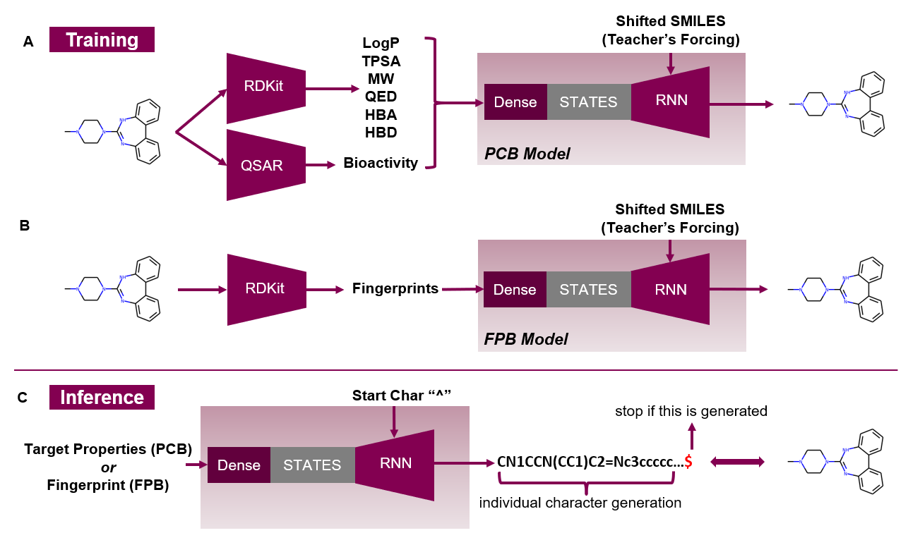

# DeepDrugCoder (DDC): A network to encode or generate molecules

[](https://github.com/pcko1/Deep-Drug-Coder) [](https://opensource.org/licenses/MIT) [](https://www.python.org/downloads/release/python-367/) [](https://github.com/ellerbrock/open-source-badges/) [](https://github.com/ambv/black)

Code for the purposes of [Direct Steering of de novo Molecular Generation using Descriptor Conditional Recurrent Neural Networks (cRNNs)](https://chemrxiv.org/articles/Direct_Steering_of_de_novo_Molecular_Generation_using_Descriptor_Conditional_Recurrent_Neural_Networks_cRNNs_/9860906).

Also part of [A De Novo Molecular Generation Method Using Latent Vector Based Generative Adversarial Network](https://chemrxiv.org/articles/A_De_Novo_Molecular_Generation_Method_Using_Latent_Vector_Based_Generative_Adversarial_Network/8299544).

___

Deep learning has acquired considerable momentum over the past couple of years in the domain of de-novo drug design. Particularly, transfer and reinforcement learning have demonstrated the capability of steering the generative process towards chemical regions of interest. In this work, we propose a simple approach to the focused generative task by constructing a conditional recurrent neural network (cRNN). For this purpose, we aggregate selected molecular descriptors along with a QSAR-based bioactivity label and transform them into initial LSTM states before starting the generation of SMILES strings that are focused towards the aspired properties. We thus tackle the inverse QSAR problem directly by training on molecular descriptors, instead of iteratively optimizing around a set of candidate molecules. The trained cRNNs are able to generate molecules near multiple specified conditions, while maintaining an output that is more focused than traditional RNNs yet less focused than autoencoders. The method shows promise for applications in both scaffold hoping and ligand series generation, depending on whether the cRNN is trained on calculated scalar molecular properties or structural fingerprints. This also demonstrates that fingerprint-to-molecule decoding is feasible, leading to molecules that are similar – if not identical – to the ones the fingerprints originated from. Additionally, the cRNN is able to generate a larger fraction of predicted active compounds against the DRD2 receptor when compared to an RNN trained with the transfer learning model.

<span style="background-color: #FFFF00">*Currently only GPU version of the model is supported. You need access to a GPU to use it.*</span>

*More detailed instructions are to be pushed soon. Please refer to the demo notebooks for usage details.*



___

### Custom Dependencies
- [molvecgen](https://github.com/EBjerrum/molvecgen)

### Installation
- Clone the repo and navigate to it.
- Create a predefined Python3.6 conda environment by `conda env create -f env/ddc_env.yml`. This ensures that you have the correct version of `rdKit` and `cudatoolkit`.
- Run `python setup.py install` to install remaining dependencies and add the package to the Python path.
- Add the environment in the drop-down list of jupyter by `python -m ipykernel install --user --name ddc_env --display-name "ddc_env (python_3.6.7)"`.

### Usage
``` bash
conda activate ddc_env
```

```python
from ddc_pub import ddc_v3 as ddc
```

### API
- `fit()`: Fit a DDC model to the dataset.
- `vectorize()`: Convert a binary RDKit molecule to its One-Hot-Encoded representation.
- `transform()`: Encode a vectorized molecule to its latent representation.
- `predict()`: Decode a latent representation into a SMILES string and return its Negative Log Likelihood (NLL).
- `predict_batch()`: Decode a list of latent representations into SMILES strings and return their NLLs.
- `get_smiles_nll()`: Back-calculate the NLL of a known SMILES string, if it was to be sampled by the biased decoder.
- `get_smiles_nll_batch()`: Back-calculate the NLLs of a batch of known SMILES strings, if they were to be sampled by the biased decoder.
- `summary()`: Display essential architectural parameters.
- `get_graphs()`: Export model graphs to .png files using `pydot` and `graphviz` ([might fail](https://github.com/AppliedDataSciencePartners/DeepReinforcementLearning/issues/3)).
- `save()`: Save the model in a .zip directory.

### Future
- Add support for `tensorflow==2.0.0` and `keras==2.3.0`.
- Add CPU support.

### Issues
Please report all installation / usage issues by opening an [issue](https://github.com/pcko1/Deep-Drug-Coder/issues) at this repo.

Currently, we have noticed erroneous behavior of some functions with `numpy.__version__==1.17.2`, please stick to `1.16.5` for now.
